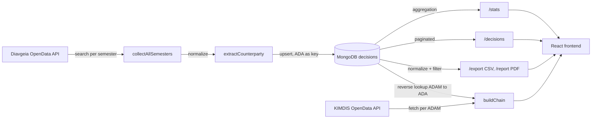

# Diavgeia + KIMDIS — Code Review and Remediation

Technical report of a code-review and clean-up pass over a full-stack tool that analyses Greek public spending. It documents the findings, the root cause of each problem, and the fixes, together with selected code excerpts and concrete, reproducible detail.

The full, runnable code lives in a separate private repository. This repository contains documentation and curated excerpts only, not the whole application.

> Glossary of Greek public-registry terms used throughout:
> - **Διαύγεια (Diavgeia)** — the transparency portal where public bodies publish every administrative act and expense.
> - **ΚΗΜΔΗΣ (KIMDIS)** — the Central Electronic Registry of Public Procurement (tenders and contracts).
> - **ΑΔΑ (ADA)** — the unique id of a Diavgeia decision (primary key of a decision).
> - **ΑΔΑΜ (ADAM)** — the unique id of a KIMDIS procurement document (request/notice/award/contract/payment).
> - **ΑΦΜ (AFM)** — a Greek tax registration number, used here to identify counterparties reliably.
> - **organizationUid** — Diavgeia's internal id of a public body. It is **not** the body's AFM.

## Scope and data

- **Object of work:** review and fix the existing backend and frontend. No re-architecture.
- **Test sample:** one public body (`organizationUid = 54446`, ΔΗΜΟΣ ΑΡΓΟΣΤΟΛΙΟΥ), 9,349 decisions. Every quantitative figure in this report comes from that sample unless explicitly marked as an estimate.
- **Verification environment:** the production MongoDB Atlas cluster was not reachable from the work environment (TLS failure caused by an IP allowlist). All checks ran against a local MongoDB (`mongodb-memory-server`) loaded with the same dataset. Timing figures are indicative of the local environment and are not production benchmarks.

## Contents

- [System overview](#system-overview)
- [Architecture principles](#architecture-principles)
- [Repository layout](#repository-layout)
- [Data model reference](#data-model-reference)
- [Methodology](#methodology)
- [Findings summary](#findings-summary)
- [The amount-calculation bug](#the-amount-calculation-bug)
- [Statistics performance](#statistics-performance)
- [Security and robustness](#security-and-robustness)
- [New functionality](#new-functionality)
- [HTTP API reference](#http-api-reference)
- [How to run](#how-to-run)
- [Verification methodology](#verification-methodology)
- [Results](#results)
- [Known limitations and next steps](#known-limitations-and-next-steps)
- [Code highlights](#code-highlights)

## System overview

A full-stack tool that unifies two public registries:

- **Diavgeia** — decisions and expenses of public bodies.
- **KIMDIS** — the Central Electronic Registry of Public Procurement.

The user selects a public body and gets statistics, a paginated list of decisions, export to CSV/PDF, and reconstruction of a contract's chain (Request, Notice, Award, Contract, Payment) with a payment-vs-value reconciliation.

| Layer | Technologies |
|---|---|
| Backend | Node.js, Express 5, MongoDB (Atlas) |
| Frontend | React, Vite |
| Data sources | Diavgeia OpenData API, KIMDIS OpenData API |

Data flow:



Contract chain (KIMDIS): `Request (REQ) -> Notice (PROC) -> Award (AWRD) -> Contract (SYMV) -> Payment (PAY)`, with reconciliation of contract value against the sum of payments.

## Architecture principles

Principles kept intact throughout the fixes:

- Group by **AFM**, never by names (names are unreliable and frequently duplicated/comma-mangled).
- `organizationUid` is not the same as the AFM.
- Negative amounts represent cancellations and are valid data.
- The `normalize`, `filters`, `stats` and `output` functions are pure, with no networking. Only the orchestrators talk to external sources.
- The `options` object is a stable contract across the whole path.

Each fix respects these. For example, the critical amount fix was made inside a pure function, without introducing any I/O.

## Repository layout

The private repository is organised as follows (one line per file; pure = no I/O):

```
backend/
  server.mjs                 Express app and all HTTP routes
  search.mjs                 Diavgeia crawler: collectAllSemesters (download per 6-month window)
  analyze.mjs                Standalone CLI: local JSON -> TXT/CSV/PDF
  src/
    normalizer.mjs           extractCounterparty + normalize            (pure)
    filters.mjs              chainedFilters (keyword/type/date/amount/…) (pure)
    statistics.mjs           calculateStats (sum/avg/median/top…)        (pure)
    grouping.mjs             groupBySemester                             (pure)
    output.mjs               toCsv / toTxt (CSV carries a BOM for Excel) (pure)
    pdfReport.mjs            PDF generation via pdfkit
  db/
    db.mjs                   Mongo connection (lazy, cached singleton)
    get-decisions.mjs        page/all queries + getDecisionTypes (distinct)
    stats-aggregate.mjs      statistics computed inside MongoDB (aggregation)
    save.mjs                 bulk upsert, ADA as the unique key
    latest.mjs               newest submissionTimestamp for incremental refresh
    find-organization.mjs    org search by label (escaped regex + Greek collation)
    find-ada-by-adam.mjs     reverse lookup ADAM -> ADA (escaped regex)
    fetch-organizations.mjs  loads organizations.json into the DB (5,419 bodies)
    setup-db.mjs             unique/normal indexes
  khmdhs/
    extract-adam.mjs         ADAM regex extractor from a decision subject
    fetch-praxis.mjs         KIMDIS API client (per document type)
    build-chain.mjs          builds the REQ->PROC->AWRD->SYMV->PAY chain
  tests/
    stats-parity.test.mjs    aggregation-vs-in-memory equivalence test
frontend/
  src/App.jsx                the entire UI (search, filters, cards, table, chain panel)
```

## Data model reference

The raw Diavgeia decision is a JSON object. The interesting payload is under `extraFieldValues` (abbreviated `efv` below). The following is measured from the 9,349-decision sample and is the practical key to everything that follows.

**Top-level fields of a decision:** `ada`, `subject`, `issueDate` (epoch **milliseconds**, a number), `submissionTimestamp` (number), `organizationId` (a **string**, e.g. `"54446"`), `decisionTypeId` (e.g. `Α.2`, `Β.1.3`, `Δ.1`, `2.4.7.1`), `extraFieldValues`, `url`, `documentUrl`, and more.

**The amount lives in a different place per decision type.** The normalizer tries paths in priority order. Measured distribution of which branch actually handles each decision:

| Branch taken | Count | Amount source (raw path) |
|---|---:|---|
| `sponsor` | 1,449 | `efv.sponsor[0].expenseAmount.amount` |
| `person` | 6 | `efv.awardAmount.amount` |
| `amountWithKae` | 1,646 | `efv.amountWithVAT.amount` (see the trap below) |
| `amountWithVAT` | 805 | `efv.amountWithVAT.amount` |
| none (no amount) | 5,443 | 0 |

**The trap.** In an `amountWithKae` decision, `efv.amountWithKae[i].amountWithVAT` is a **plain number**, while the top-level `efv.amountWithVAT` is an **object** `{ amount, currency }`. Two fields with the same name and different shapes:

```jsonc
// efv.amountWithKae[0]  -> amountWithVAT is a NUMBER
{ "kae": "0.64.98.95.0001", "amountWithVAT": 3542.45, "kaeCreditRemainder": 4071.41, "kaeBudgetRemainder": 4071.41 }

// efv.amountWithVAT      -> amountWithVAT is an OBJECT
{ "amount": 3542.45, "currency": "EUR" }
```

**Fields are not always arrays.** Measured shapes of the fields the code calls `.length` / `$size` on:

| Field | array | null | bare object |
|---|---:|---:|---:|
| `sponsor` | 1,450 | 4,069 | 0 |
| `person` | 33 | 11 | **15** |
| `amountWithKae` | 2,452 | 3 | 0 |

The 15 `person` bare-objects are exactly what broke the first aggregation attempt (see [Statistics performance](#statistics-performance)).

## Methodology

1. Map and read every module.
2. Analyse the real raw JSON (9,349 decisions) to document the actual data shapes.
3. Compare the implementation against the real data to find divergences.
4. Fix inside pure functions.
5. Verify offline against a real MongoDB (in-memory) on the same dataset.
6. Regression: confirm the new path produces identical results to the previous one.

Step 2 surfaced the critical bug: inspecting the real contents of `extraFieldValues` revealed the mismatch between the schema the code assumed and the real one.

## Findings summary

| # | Finding | Category | Severity |
|---|---------|----------|----------|
| 1 | Wrong amount path read for a subset of decisions, yielding `amount = 0` | Correctness | Critical |
| 2 | `/stats` loaded every decision of a body into memory on each call | Performance | High |
| 3 | The CSV export button called a non-existent endpoint (404) | Bug | High |
| 4 | Unescaped user input in Mongo `$regex` (regex injection / ReDoS) | Security | High |
| 5 | Returned 404 "no data" even for genuine database errors | Robustness | Medium |
| 6 | Missing refresh button and decision-type filter | Functionality | Medium |
| 7 | Dead role filter; unidentified counterparty ranked among top sponsors | Cleanliness | Low |

## The amount-calculation bug

### Symptom

Totals per body were far lower than expected. For the test body the total was computed as 6,383,282.20 EUR.

### Root cause

The `amountWithKae` branch read:

```js
amount = efv.amountWithKae[0].amountWithVAT?.amount ?? 0;
```

Since `efv.amountWithKae[i].amountWithVAT` is a number, reading `.amount` on it returns `undefined`, so the amount silently fell back to 0. The real total is on the top-level `efv.amountWithVAT.amount`.

### Extent

| Metric | Value |
|---|---|
| Decisions zeroed | 1,646 (17.6% of 9,349) |
| Amount lost | 15,678,275.72 EUR |
| Total before | 6,383,282.20 EUR |
| Total after | 22,061,557.92 EUR |

### Fix

The logic was extracted into a pure `extractCounterparty` function, shared by the normalizer and the aggregation pipeline, with the correct path and a fallback that sums the per-KAE lines. Full detail: [`code-highlights/01-normalizer-amount-bug.md`](code-highlights/01-normalizer-amount-bug.md).

## Statistics performance

`GET /stats/:afm` fetched every decision of a body into Node memory (up to roughly 45,000 for large bodies — an estimate), normalised, filtered and computed, on every call.

The computation was moved into MongoDB via a `$facet` aggregation pipeline (`stats-aggregate.mjs`). The amount is computed inline with `$switch` over the same paths as the normalizer, and filters (type, date, amount, keyword, counterparty) are applied via `$match`.

During implementation the raw fields turned out not to always be arrays: `person` is sometimes a bare object and `sponsor` is sometimes `null`. `$size` requires an array, so every use of it is guarded with `$isArray` so the behaviour matches the JavaScript `x && x.length > 0` check exactly. Full detail: [`code-highlights/02-stats-aggregation.md`](code-highlights/02-stats-aggregation.md).

## Security and robustness

Regex injection / ReDoS. Org search and the ADAM reverse lookup put unescaped input into a Mongo `$regex`. Input such as `(a+)+` can cause catastrophic backtracking. An `escapeRegex` helper was added at every such point.

Error handling. A blanket `catch` turned every failure into a 404 "no data", even a database outage. The handling was split: 404 for an empty result, 500 for a genuine error, with logging.

Secrets out of version control. `backend/.env` holds `MONGO_URI` and was excluded via `.gitignore`; a placeholder `.env.example` was added. Before the first commit it was explicitly verified that no `.env`, dataset or `node_modules` entered the index. Full detail: [`code-highlights/03-security-hardening.md`](code-highlights/03-security-hardening.md).

## New functionality

| Feature | Backend | Frontend |
|---|---|---|
| CSV/Excel export | New `GET /export/:afm` | Fixed existing button |
| Manual refresh | New `GET /refresh/:afm` (incremental) | New refresh button |
| Decision-type filter | New `GET /types/:afm` | Dropdown instead of free text |

Additionally, a dead role filter was removed (it relied on `organizationAfm`, which is never populated) and the unidentified counterparty was excluded from the top-sponsors list while remaining in the totals. Full detail: [`code-highlights/04-new-endpoints.md`](code-highlights/04-new-endpoints.md).

## HTTP API reference

All routes are `GET`. `:afm` is the `organizationUid`. Filter query params are shared: `keyword`, `type`, `startDate`, `endDate`, `minAmount`, `maxAmount`, `counterparty`.

| Route | Query params | Returns |
|---|---|---|
| `/stats/:afm` | filters | stats JSON (sum, counts, average, median, min, max, topSponsors) |
| `/decisions/:afm` | `page`, `pageSize`, filters | `{ total, page, pageSize, decisions[] }` |
| `/export/:afm` | `format=csv`, filters | CSV file (UTF-8 with BOM) |
| `/report/:afm` | filters | PDF file (streamed) |
| `/grouped/:afm` | filters | decisions grouped by year+semester |
| `/types/:afm` | — | `string[]` of decisionTypeId |
| `/organizations/search` | `q` (min 3 chars) | `[{ uid, label }]` |
| `/ensure/:afm` | — | `{ status: "exists" \| "downloaded" }` |
| `/refresh/:afm` | — | `{ status: "refreshed", incremental }` |
| `/chain/:adam` | — | `{ root, links[] }` |

Example (against a running backend):

```bash
curl -s "http://localhost:3000/stats/54446" | head -c 300
# {"sum":22061557.92,"decisionsLength":9349,"withAmountLength":3363,
#  "withoutAmountCount":5986,"average":6560.08...,"median":932,
#  "max":1212323.02,"min":0.01,"topSponsors":[...]}

curl -s "http://localhost:3000/export/54446?format=csv" -o out.csv    # CSV, opens cleanly in Excel
curl -s "http://localhost:3000/types/54446"                           # ["100","2.4.6.1",...,"Β.1.3",...]
```

## How to run

Prerequisite: `backend/.env` must contain `MONGO_URI` (copy `backend/.env.example` and fill it in).

Backend (terminal A, leave running):

```bash
cd backend && npm install && npm start
```

`npm start` runs `node --env-file=.env server.mjs` and listens on `http://localhost:3000`.

Frontend (terminal B, leave running):

```bash
cd frontend && npm install && npm run dev
```

Open the URL Vite prints (usually `http://localhost:5173`).

First-time data setup (only if the collections are empty):

```bash
cd backend
node db/setup-db.mjs                                   # indexes (ada unique, organizationId, uid)
node --env-file=.env db/fetch-organizations.mjs        # load all 5,419 public bodies
node --env-file=.env search.mjs 54446                  # crawl a body's decisions into the DB
```

Run the equivalence test:

```bash
cd backend && npm test
```

## Verification methodology

Because Atlas was unreachable, verification was done offline:

1. Start a real MongoDB in memory (`mongodb-memory-server`).
2. Load the real dataset (9,349 decisions).
3. Equivalence check: compare every metric between the previous in-memory path and the new aggregation, with and without filters.
4. HTTP integration check: start the Express server and hit every endpoint.

The `$size` / `$isArray` bug was found precisely because the test ran against a real MongoDB rather than a mock. The equivalence check is implemented as a runnable test in the private repo (`backend/tests/stats-parity.test.mjs`, `npm test`) that stands up the in-memory MongoDB itself — not pasted output but a repeatable test. Full detail and outputs: [`code-highlights/05-testing-offline.md`](code-highlights/05-testing-offline.md).

## Results

| Metric | Before | After |
|---|---|---|
| Body total (correctness) | 6,383,282.20 EUR | 22,061,557.92 EUR |
| Decisions with a valid amount | 1,717 | 3,363 |
| `/stats` load into Node memory | all decisions of the body | none (computed in the DB) |
| CSV export | 404 | working |
| Regex-injection surface | exposed | escaped |
| Database errors | returned as 404 | returned as 500 |
| Frontend build and lint | — | passing |

Amounts and counts are for the sample body (9,349 decisions). The performance gain is architectural: the computation runs in the database instead of moving every document into Node, regardless of body size.

## Known limitations and next steps

Items found but deliberately left out of this cycle:

- `/decisions` with active filters still loads all of a body's decisions into memory and filters in Node. It could move to aggregation/`$match`, like `/stats` did.
- The pipeline median collects amounts with `$push` into one array. For very large bodies this grows the aggregation's memory (`allowDiskUse` is set); a two-pass approach would scale better.
- `organizationAfm` is not populated by the normalizer, so role-based filters/stats ("paid" vs "received") are not possible without an extra uid-to-AFM mapping.
- ADAM-to-ADA reverse lookup uses `$regex` over `subject`. It works, but an indexed structured field would be faster and more precise.
- Figures come from one body. Confirmation across more bodies would strengthen generalisation.

## Code highlights

| File | Content |
|---|---|
| [01 — Amount bug](code-highlights/01-normalizer-amount-bug.md) | Root cause and fix, before/after |
| [02 — Statistics aggregation](code-highlights/02-stats-aggregation.md) | Pipeline and schema handling |
| [03 — Security](code-highlights/03-security-hardening.md) | Regex escaping and error handling |
| [04 — New endpoints](code-highlights/04-new-endpoints.md) | export, refresh, types, with curl examples |
| [05 — Offline verification](code-highlights/05-testing-offline.md) | Testing without database access |

## Access to the source

The full runnable code (backend and frontend) is in a private repository with access limited to the owner. This repository holds documentation and selected excerpts.
