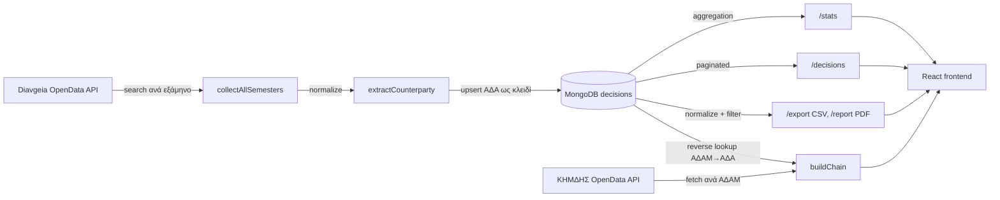

# Διαύγεια + ΚΗΜΔΗΣ — Ανάλυση κώδικα και διορθώσεις

Τεχνική αναφορά της εργασίας code review και εξυγίανσης που έγινε πάνω σε ένα full-stack εργαλείο ανάλυσης δημόσιων δαπανών. Το κείμενο τεκμηριώνει τα ευρήματα, την αιτία κάθε προβλήματος και τις διορθώσεις, μαζί με επιλεγμένα αποσπάσματα κώδικα.

Ο πλήρης, εκτελέσιμος κώδικας βρίσκεται σε ξεχωριστό ιδιωτικό repository. Εδώ παρατίθενται μόνο τα σχετικά αποσπάσματα, όχι ολόκληρη η εφαρμογή.

## Εύρος και δεδομένα

- Αντικείμενο: review και διόρθωση του υπάρχοντος backend και frontend. Δεν έγινε επανασχεδιασμός.
- Δείγμα ελέγχου: ένας φορέας (organizationUid 54446), 9.349 πράξεις. Όλα τα ποσοτικά στοιχεία του κειμένου προέρχονται από αυτό το δείγμα, εκτός αν αναφέρεται ρητά ότι πρόκειται για εκτίμηση.
- Περιβάλλον επαλήθευσης: το production MongoDB Atlas δεν ήταν προσβάσιμο· οι έλεγχοι έγιναν σε τοπική MongoDB (in-memory) με το ίδιο dataset. Οι μετρήσεις χρόνου είναι ενδεικτικές του τοπικού περιβάλλοντος και δεν αποτελούν benchmark παραγωγής.

## Περιεχόμενα

- [Το σύστημα](#το-σύστημα)
- [Αρχιτεκτονικές αρχές](#αρχιτεκτονικές-αρχές)
- [Μεθοδολογία](#μεθοδολογία)
- [Σύνοψη ευρημάτων](#σύνοψη-ευρημάτων)
- [Σφάλμα υπολογισμού ποσού](#σφάλμα-υπολογισμού-ποσού)
- [Επίδοση των στατιστικών](#επίδοση-των-στατιστικών)
- [Ασφάλεια και ανθεκτικότητα](#ασφάλεια-και-ανθεκτικότητα)
- [Νέα λειτουργικότητα](#νέα-λειτουργικότητα)
- [Μεθοδολογία επαλήθευσης](#μεθοδολογία-επαλήθευσης)
- [Αποτελέσματα](#αποτελέσματα)
- [Γνωστοί περιορισμοί και επόμενα βήματα](#γνωστοί-περιορισμοί-και-επόμενα-βήματα)
- [Αποσπάσματα κώδικα](#αποσπάσματα-κώδικα)

## Το σύστημα

Full-stack εργαλείο που ενοποιεί δύο δημόσια μητρώα:

- Διαύγεια — αποφάσεις και δαπάνες του Δημοσίου.
- ΚΗΜΔΗΣ — Κεντρικό Ηλεκτρονικό Μητρώο Δημοσίων Συμβάσεων.

Ο χρήστης επιλέγει φορέα και λαμβάνει στατιστικά, αναλυτικές πράξεις με σελιδοποίηση, εξαγωγή σε CSV/PDF, και ανασύνθεση της αλυσίδας μιας σύμβασης (Αίτημα, Προκήρυξη, Ανάθεση, Σύμβαση, Πληρωμή) με έλεγχο συμφωνίας ποσών.

| Επίπεδο | Τεχνολογίες |
|---|---|
| Backend | Node.js, Express 5, MongoDB (Atlas) |
| Frontend | React, Vite |
| Πηγές δεδομένων | Diavgeia OpenData API, ΚΗΜΔΗΣ OpenData API |

Ροή δεδομένων:



Αλυσίδα σύμβασης (ΚΗΜΔΗΣ): `Αίτημα (REQ) → Προκήρυξη (PROC) → Ανάθεση (AWRD) → Σύμβαση (SYMV) → Πληρωμή (PAY)`, με αντιπαραβολή αξίας σύμβασης και συνόλου πληρωμών.

## Αρχιτεκτονικές αρχές

Αρχές που τηρήθηκαν καθ' όλη τη διάρκεια των διορθώσεων:

- Ομαδοποίηση με ΑΦΜ, όχι με ονόματα (τα ονόματα είναι αναξιόπιστα και συχνά διπλογραμμένα).
- Το `organizationUid` δεν ταυτίζεται με το ΑΦΜ.
- Τα αρνητικά ποσά αντιστοιχούν σε ακυρώσεις και αποτελούν έγκυρα δεδομένα.
- Οι συναρτήσεις normalize, filters, stats και output είναι καθαρές, χωρίς δικτύωση. Μόνο οι orchestrators επικοινωνούν με εξωτερικές πηγές.
- Το αντικείμενο `options` αποτελεί σταθερό συμβόλαιο σε όλη τη διαδρομή.

Κάθε διόρθωση σέβεται τις παραπάνω αρχές. Ενδεικτικά, η διόρθωση του υπολογισμού ποσού έγινε σε καθαρή συνάρτηση, χωρίς εισαγωγή I/O.

## Μεθοδολογία

1. Χαρτογράφηση και ανάγνωση όλων των modules.
2. Ανάλυση του πραγματικού raw JSON (9.349 πράξεις) για τεκμηρίωση των πραγματικών σχημάτων δεδομένων.
3. Σύγκριση της υλοποίησης με τα πραγματικά δεδομένα για εντοπισμό αποκλίσεων.
4. Διόρθωση σε καθαρές συναρτήσεις.
5. Επαλήθευση offline με πραγματική MongoDB (in-memory) πάνω στο ίδιο dataset.
6. Έλεγχοι παλινδρόμησης: επιβεβαίωση ότι η νέα διαδρομή παράγει ταυτόσημα αποτελέσματα με την προηγούμενη.

Το βήμα 2 ανέδειξε το κρίσιμο σφάλμα: η εξέταση του πραγματικού περιεχομένου του `extraFieldValues` αποκάλυψε ασυμφωνία μεταξύ του σχήματος που υπέθετε ο κώδικας και του πραγματικού.

## Σύνοψη ευρημάτων

| # | Εύρημα | Κατηγορία | Σοβαρότητα |
|---|--------|-----------|------------|
| 1 | Ανάγνωση λανθασμένου path ποσού για ένα υποσύνολο πράξεων, με αποτέλεσμα `amount = 0` | Ορθότητα | Κρίσιμη |
| 2 | Το `/stats` φόρτωνε όλες τις πράξεις του φορέα στη μνήμη σε κάθε κλήση | Επίδοση | Υψηλή |
| 3 | Το κουμπί εξαγωγής CSV καλούσε ανύπαρκτο endpoint (404) | Σφάλμα | Υψηλή |
| 4 | Μη ελεγμένη είσοδος χρήστη σε Mongo `$regex` (regex injection / ReDoS) | Ασφάλεια | Υψηλή |
| 5 | Επιστροφή 404 «no data» ακόμη και σε πραγματικά σφάλματα βάσης | Ανθεκτικότητα | Μεσαία |
| 6 | Έλλειψη κουμπιού refresh και φίλτρου τύπου απόφασης | Λειτουργικότητα | Μεσαία |
| 7 | Ανενεργό φίλτρο ρόλου· μη ταυτοποιημένος αντισυμβαλλόμενος στους κορυφαίους αναδόχους | Καθαρότητα | Χαμηλή |

## Σφάλμα υπολογισμού ποσού

### Σύμπτωμα

Τα συνολικά ποσά ανά φορέα ήταν σημαντικά χαμηλότερα από το αναμενόμενο. Για τον φορέα ελέγχου, το σύνολο υπολογιζόταν σε 6.383.282,20 ευρώ.

### Αιτία

Στη Διαύγεια το ποσό μιας πράξης βρίσκεται σε διαφορετικό nested path ανά τύπο απόφασης. Ο normalizer τα χειριζόταν σωστά, με μία εξαίρεση. Για τον τύπο `amountWithKae`, διάβαζε:

```js
amount = efv.amountWithKae[0].amountWithVAT?.amount ?? 0;
```

Στα raw δεδομένα, το `amountWithKae[i].amountWithVAT` είναι αριθμός (π.χ. `3542.45`), όχι αντικείμενο `{ amount, currency }`. Η ανάγνωση `.amount` επί αριθμού επιστρέφει `undefined`, οπότε το ποσό μηδενιζόταν χωρίς σφάλμα. Το πραγματικό συνολικό ποσό βρίσκεται στο top-level `efv.amountWithVAT.amount`.

### Έκταση

| Μέγεθος | Τιμή |
|---|---|
| Πράξεις που μηδενίζονταν | 1.646 (17,6% των 9.349) |
| Ποσό που χανόταν | 15.678.275,72 ευρώ |
| Σύνολο πριν | 6.383.282,20 ευρώ |
| Σύνολο μετά | 22.061.557,92 ευρώ |

### Διόρθωση

Η λογική εξήχθη σε καθαρή συνάρτηση `extractCounterparty`, κοινή για τον normalizer και το aggregation pipeline, με σωστό path και fallback σε άθροισμα των επιμέρους γραμμών KAE. Αναλυτικά: [`code-highlights/01-normalizer-amount-bug.md`](code-highlights/01-normalizer-amount-bug.md).

## Επίδοση των στατιστικών

Το `GET /stats/:afm` έφερνε όλες τις πράξεις του φορέα στη μνήμη του Node (έως περίπου 45.000 για μεγάλους φορείς), τις κανονικοποιούσε και υπολόγιζε στατιστικά σε κάθε κλήση.

Ο υπολογισμός μεταφέρθηκε στη MongoDB μέσω aggregation pipeline (`stats-aggregate.mjs`). Το ποσό υπολογίζεται inline με `$switch` πάνω στα ίδια paths με τον normalizer, και τα φίλτρα (τύπος, ημερομηνία, ποσό, λέξη-κλειδί, αντισυμβαλλόμενος) εφαρμόζονται μέσω `$match`.

Κατά την υλοποίηση εντοπίστηκε ότι ορισμένα raw πεδία δεν είναι πάντοτε πίνακες: το `person` εμφανίζεται ενίοτε ως μεμονωμένο αντικείμενο και το `sponsor` ως `null`. Ο τελεστής `$size` απαιτεί πίνακα, οπότε κάθε χρήση του προστατεύεται με `$isArray` ώστε η συμπεριφορά να ταυτίζεται με τον έλεγχο `x && x.length > 0` του JavaScript. Αναλυτικά: [`code-highlights/02-stats-aggregation.md`](code-highlights/02-stats-aggregation.md).

## Ασφάλεια και ανθεκτικότητα

Regex injection / ReDoS. Η αναζήτηση φορέα και το reverse lookup ΑΔΑΜ τοποθετούσαν μη ελεγμένη είσοδο σε Mongo `$regex`. Είσοδος όπως `(a+)+` μπορεί να προκαλέσει catastrophic backtracking. Προστέθηκε συνάρτηση `escapeRegex` σε κάθε τέτοιο σημείο.

Χειρισμός σφαλμάτων. Ένα γενικό `catch` επέστρεφε 404 «δεν βρέθηκαν δεδομένα» ακόμη και όταν η αιτία ήταν αστοχία της βάσης. Ο χειρισμός διαχωρίστηκε: 404 για κενό αποτέλεσμα, 500 για πραγματικό σφάλμα, με καταγραφή για διάγνωση.

Μυστικά εκτός version control. Το `backend/.env` περιέχει το `MONGO_URI` και αποκλείστηκε μέσω `.gitignore`. Προστέθηκε `.env.example` με placeholder. Πριν το πρώτο commit επιβεβαιώθηκε ρητά ότι δεν συμπεριλήφθηκε κανένα `.env`, dataset ή `node_modules`. Αναλυτικά: [`code-highlights/03-security-hardening.md`](code-highlights/03-security-hardening.md).

## Νέα λειτουργικότητα

| Λειτουργία | Backend | Frontend |
|---|---|---|
| Εξαγωγή CSV/Excel | Νέο `GET /export/:afm` | Διόρθωση υπάρχοντος κουμπιού |
| Χειροκίνητο refresh | Νέο `GET /refresh/:afm` (incremental) | Νέο κουμπί ανανέωσης |
| Φίλτρο τύπου απόφασης | Νέο `GET /types/:afm` | Dropdown αντί ελεύθερου κειμένου |

Επιπλέον, αφαιρέθηκε ανενεργό φίλτρο ρόλου (βασιζόταν στο `organizationAfm`, το οποίο δεν συμπληρωνόταν ποτέ) και ο μη ταυτοποιημένος αντισυμβαλλόμενος εξαιρέθηκε από τους κορυφαίους αναδόχους, παραμένοντας στα συνολικά ποσά. Αναλυτικά: [`code-highlights/04-new-endpoints.md`](code-highlights/04-new-endpoints.md).

## Μεθοδολογία επαλήθευσης

Το production MongoDB Atlas δεν ήταν προσβάσιμο από το περιβάλλον εργασίας (αστοχία TLS λόγω IP allowlist). Η επαλήθευση έγινε offline:

1. Εκκίνηση πραγματικής MongoDB στη μνήμη (`mongodb-memory-server`).
2. Φόρτωση του πραγματικού dataset (9.349 πράξεις).
3. Έλεγχος ισοδυναμίας: σύγκριση κάθε μετρικής μεταξύ της προηγούμενης in-memory διαδρομής και του νέου aggregation, με και χωρίς φίλτρα.
4. Έλεγχος ενοποίησης HTTP: εκκίνηση του Express server και κλήση όλων των endpoints.

Το bug των `$size` / `$isArray` εντοπίστηκε ακριβώς επειδή η δοκιμή έτρεξε σε πραγματική MongoDB και όχι σε mock. Αναλυτικά: [`code-highlights/05-testing-offline.md`](code-highlights/05-testing-offline.md).

Ο έλεγχος ισοδυναμίας είναι υλοποιημένος ως εκτελέσιμο test στο ιδιωτικό repository (`backend/tests/stats-parity.test.mjs`, `npm test`) και στήνει μόνος του την in-memory MongoDB. Δεν είναι επικολλημένη έξοδος αλλά επαναλήψιμη δοκιμή.

## Αποτελέσματα

| Μετρική | Πριν | Μετά |
|---|---|---|
| Συνολικό ποσό φορέα | 6.383.282,20 ευρώ | 22.061.557,92 ευρώ |
| Πράξεις με έγκυρο ποσό | 1.717 | 3.363 |
| Φόρτωση `/stats` στη μνήμη Node | όλες οι πράξεις του φορέα | καμία (υπολογισμός στη βάση) |
| Εξαγωγή CSV | 404 | λειτουργική |
| Επιφάνεια regex injection | εκτεθειμένη | escaped |
| Σφάλματα βάσης | επιστρέφονταν ως 404 | επιστρέφονται ως 500 |
| Frontend build και lint | — | επιτυχή |

Τα ποσά και τα πλήθη αφορούν τον φορέα του δείγματος (9.349 πράξεις). Το κέρδος επίδοσης είναι αρχιτεκτονικό: ο υπολογισμός γίνεται στη βάση αντί για μεταφορά όλων των εγγράφων στο Node, ανεξαρτήτως μεγέθους φορέα.

## Γνωστοί περιορισμοί και επόμενα βήματα

Στοιχεία που εντοπίστηκαν αλλά δεν καλύφθηκαν σε αυτόν τον κύκλο, με συνειδητή επιλογή εύρους:

- Το `/decisions` με ενεργά φίλτρα εξακολουθεί να φορτώνει όλες τις πράξεις του φορέα στη μνήμη και να φιλτράρει στο Node. Θα μπορούσε να μεταφερθεί σε aggregation/`$match`, όπως έγινε στο `/stats`.
- Ο διάμεσος (median) στο pipeline συγκεντρώνει τα ποσά με `$push` σε έναν πίνακα. Για πολύ μεγάλους φορείς αυτό αυξάνει τη μνήμη του aggregation· υπάρχει `allowDiskUse`, αλλά μια προσέγγιση δύο περασμάτων θα ήταν πιο κλιμακώσιμη.
- Το πεδίο `organizationAfm` δεν συμπληρώνεται από τον normalizer, οπότε φίλτρα και στατιστικά «ανά ρόλο» (έδωσε/πήρε) δεν είναι εφικτά χωρίς πρόσθετη πηγή αντιστοίχισης uid προς ΑΦΜ.
- Η αντιστοίχιση ΑΔΑΜ προς ΑΔΑ στο reverse lookup γίνεται με `$regex` πάνω στο `subject`. Λειτουργεί, αλλά ένα ευρετηριασμένο, δομημένο πεδίο θα ήταν ταχύτερο και ακριβέστερο.
- Τα ποσοτικά στοιχεία προέρχονται από έναν φορέα. Επιβεβαίωση σε περισσότερους φορείς θα ενίσχυε τη γενίκευση.

## Αποσπάσματα κώδικα

| Αρχείο | Περιεχόμενο |
|---|---|
| [01 — Σφάλμα ποσού](code-highlights/01-normalizer-amount-bug.md) | Αιτία και διόρθωση, πριν/μετά |
| [02 — Aggregation στατιστικών](code-highlights/02-stats-aggregation.md) | Pipeline και χειρισμός σχημάτων |
| [03 — Ασφάλεια](code-highlights/03-security-hardening.md) | Regex escaping και χειρισμός σφαλμάτων |
| [04 — Νέα endpoints](code-highlights/04-new-endpoints.md) | export, refresh, types |
| [05 — Επαλήθευση offline](code-highlights/05-testing-offline.md) | Δοκιμές χωρίς πρόσβαση στη βάση |

## Πρόσβαση στον κώδικα

Ο πλήρης εκτελέσιμος κώδικας (backend και frontend) βρίσκεται σε ιδιωτικό repository με πρόσβαση περιορισμένη στον ιδιοκτήτη. Το παρόν repository περιέχει τεκμηρίωση και επιλεγμένα αποσπάσματα.
